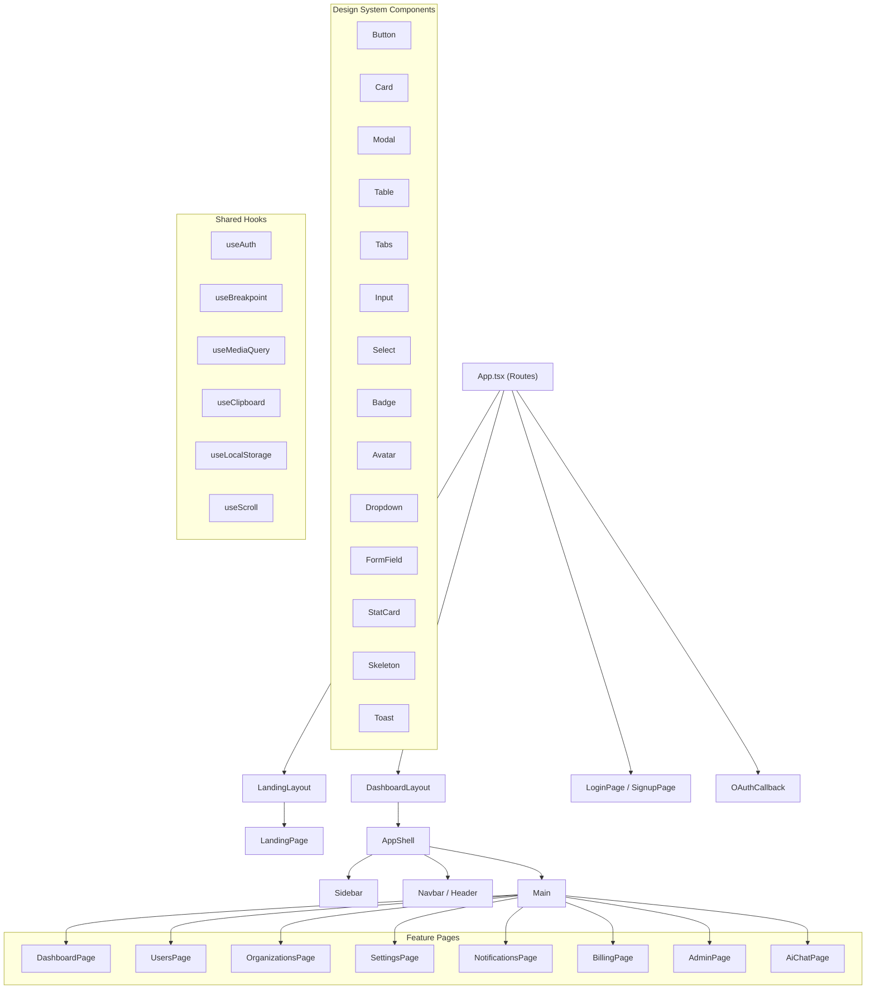
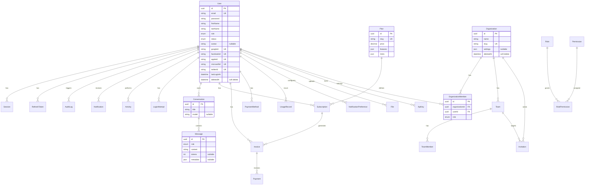
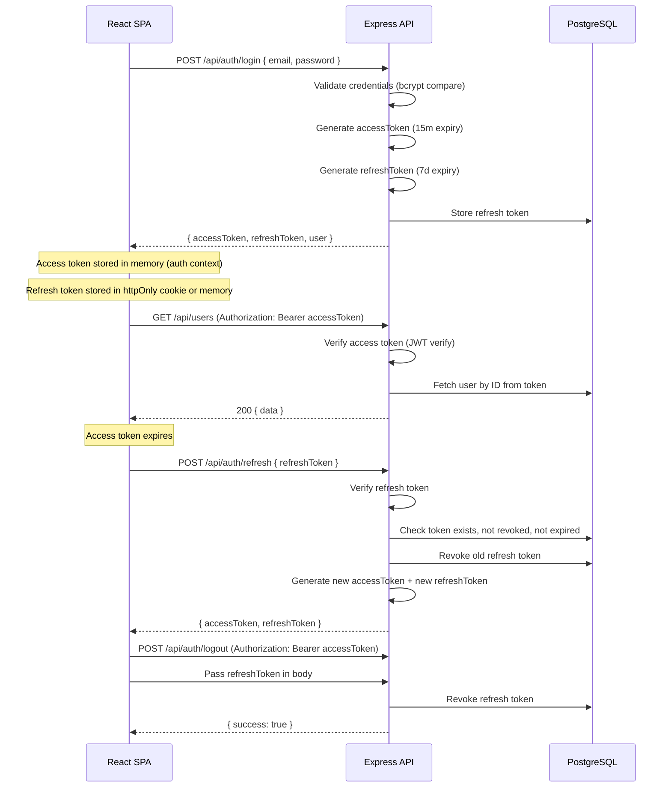
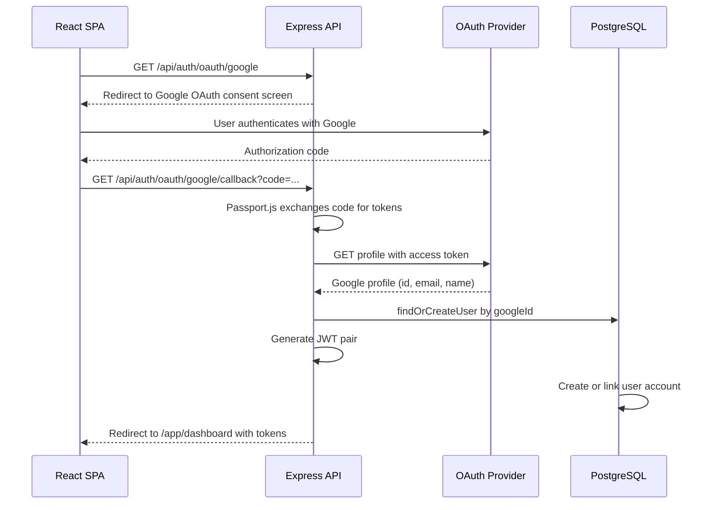

# Architecture

## Overview

RyoFramework is a full-stack SaaS framework built with a modern client-server architecture. The stack consists of a **React SPA** frontend (built with Vite) communicating with an **Express.js** REST API over HTTP, backed by a **PostgreSQL** database accessed through the **Prisma ORM**. The framework is designed with AI capabilities as a first-class concern, featuring an integrated AI chat subsystem powered by Groq.

```
┌─────────────────────────────────────────────────────────┐
│                     Client (React SPA)                   │
│  ┌─────────────────────────────────────────────────────┐ │
│  │  Vite (Build / Dev Server)   Port 5173              │ │
│  │  ┌──────────┐ ┌──────────┐ ┌────────────────────┐  │ │
│  │  │   React   │ │  React   │ │    TanStack Query   │  │ │
│  │  │  Router   │ │   Hook   │ │   (Server State)    │  │ │
│  │  │           │ │  Form    │ │                      │  │ │
│  │  └──────────┘ └──────────┘ └────────────────────┘  │ │
│  │  ┌────────────────────────────────────────────────┐ │ │
│  │  │            Design System (Radix UI + Tailwind)  │ │ │
│  │  └────────────────────────────────────────────────┘ │ │
│  └─────────────────────────────────────────────────────┘ │
└──────────────────────────┬──────────────────────────────┘
                           │ HTTP (JSON)
                           │ Port 5173 → proxy → Port 4000
                           ▼
┌─────────────────────────────────────────────────────────┐
│                  Express.js API Server                   │
│  ┌─────────────────────────────────────────────────────┐ │
│  │  Middleware Stack                                    │ │
│  │  helmet → cors → compression → morgan → rate-limit  │ │
│  │  passport → routes → validate → auth → controller   │ │
│  └─────────────────────────────────────────────────────┘ │
│  ┌────────┐ ┌──────────┐ ┌──────────┐ ┌──────────────┐ │ │
│  │ Routes │ │Controllers│ │ Services │ │   Prisma     │ │ │
│  │        │ │           │ │          │ │   Client     │ │ │
│  └────────┘ └──────────┘ └──────────┘ └──────────────┘ │ │
└──────────────────────────┬──────────────────────────────┘
                           │ SQL
                           ▼
┌─────────────────────────────────────────────────────────┐
│                    PostgreSQL                            │
│  Users · Orgs · Teams · Billing · AI Conversations      │
└─────────────────────────────────────────────────────────┘
```

## Frontend Architecture

### Build System (Vite)

The frontend uses **Vite 5** as the build tool and dev server. It runs on port 5173 with an API proxy that forwards `/api/*` requests to the backend at `localhost:4000`, eliminating CORS issues during development.

- **TypeScript** throughout the frontend
- Path alias `@/` mapped to `./src` for clean imports
- Hot Module Replacement (HMR) via Vite's React plugin

### Routing (React Router v6)

Routing is organized in a single `<Routes>` tree in `App.tsx`. The app distinguishes three route categories:

| Route Group | Layout | Auth Requirement |
|---|---|---|
| `/` (Landing) | LandingLayout | Public |
| `/app/login`, `/app/signup` | None (standalone) | Public (redirect if authed) |
| `/app/*` (Dashboard) | DashboardLayout | Requires authentication |
| `/oauth/callback` | None | OAuth handshake |

Protected routes use wrapper components: `ProtectedRoute` (any authenticated user), `AdminRoute` (ADMIN / SUPER_ADMIN role), and `PublicRoute` (redirects to dashboard if already logged in).

### Server State (TanStack Query)

All API data fetching uses **TanStack Query v5** for:
- Automatic caching and background refetching
- Optimistic updates for mutations
- Paginated list queries with `keepPreviousData`
- Query invalidation on related mutations

### Design System

A comprehensive design system lives under `src/design-system/` with:
- **Radix UI** primitives (accordion, dialog, dropdown, popover, select, tabs, toast, tooltip, etc.)
- **Tailwind CSS** for utility-first styling
- **Custom design tokens** (colors, typography, spacing, radius, shadows)
- **Layout components**: AppShell, Container, PageHeader
- **Animation system**: GSAP for rich animations, Lenis for smooth scrolling
- **Theme provider** with light/dark/system mode support

### Component Hierarchy



### Key Frontend Dependencies

| Package | Purpose |
|---|---|
| react-router-dom v6 | Client-side routing |
| @tanstack/react-query v5 | Server state management |
| react-hook-form + zod | Form handling + validation |
| @radix-ui/* | Accessible UI primitives |
| tailwindcss + tailwindcss-animate | Styling |
| gsap + lenis | Animations and smooth scroll |
| lucide-react | Icon library |
| recharts | Charts and data visualization |
| axios | HTTP client |

## Backend Architecture

### Server Initialization

The server entry point (`server.js`) connects to the database via Prisma, then starts listening. It handles graceful shutdown on SIGTERM/SIGINT by disconnecting Prisma and exiting cleanly.

### Middleware Stack

The Express app (`app.js`) applies middleware in this order:

1. **helmet** — Security headers
2. **cors** — Cross-origin requests (origin from config)
3. **compression** — Gzip response compression
4. **morgan** — Request logging (dev format)
5. **express.json** (10mb limit) — Body parsing
6. **express.urlencoded** — URL-encoded body parsing
7. **rate-limit** — 100 requests per 15-minute window on `/api/`
8. **passport** — OAuth authentication strategies
9. **Routes** — All API route modules
10. **Not-found handler** — 404 for unknown routes
11. **Error handler** — Catches and formats errors

### Layered Architecture (3-Tier)

```
HTTP Request
    │
    ▼
┌──────────────┐
│    Routes    │  Router → middleware → controller binding
│  (routers/)  │  Define HTTP methods, URL paths, middleware chain
└──────┬───────┘
       │
       ▼
┌──────────────┐
│ Controllers  │  Handle req/res, parse validated data, call services
│(controllers/)|  NEVER access DB directly
└──────┬───────┘
       │
       ▼
┌──────────────┐
│   Services   │  Business logic, orchestration, DB queries via Prisma
│ (services/)  │  Throw ApiError for error cases
└──────┬───────┘
       │
       ▼
┌──────────────┐
│    Prisma    │  ORM client — type-safe database access
│   (config/   │
│  database.js)│
└──────┬───────┘
       │
       ▼
┌──────────────┐
│ PostgreSQL   │  Relational database
└──────────────┘
```

### Request Lifecycle

```mermaid
sequenceDiagram
    participant Client as React SPA
    participant Vite as Vite Proxy
    participant Express as Express App
    participant MW as Middleware Stack
    participant Route as Route Handler
    participant Validate as Validation MW
    participant Auth as Auth MW
    participant Ctrl as Controller
    participant Svc as Service
    participant Prisma as Prisma ORM
    participant DB as PostgreSQL

    Client->>Vite: HTTP Request
    Vite->>Express: Proxy to :4000
    Express->>MW: helmet, cors, compression, morgan
    MW->>MW: rate-limit check
    MW->>Route: Match route
    Route->>Validate: Zod schema validation
    Validate-->>Route: req.validated

    alt Protected Route
        Route->>Auth: authenticate()
        Auth->>Prisma: Find user by JWT
        Prisma-->>Auth: User record
        Auth-->>Route: req.user set
    end

    Route->>Ctrl: Controller function
    Ctrl->>Svc: Call service with validated data
    Svc->>Prisma: Query / mutate
    Prisma->>DB: SQL
    DB-->>Prisma: Result
    Prisma-->>Svc: Data
    Svc-->>Ctrl: Return result
    Ctrl-->>Client: JSON response { success, data, message }
```



### API Endpoints

All endpoints are prefixed with `/api/`. Below is the full route table:

| Prefix | File | Description |
|---|---|---|
| `/api/auth` | `routes/auth.js` | Login, signup, refresh, logout, password reset |
| `/api/auth/oauth` | `routes/oauth.js` | OAuth provider callbacks |
| `/api/users` | `routes/users.js` | User CRUD, profile management |
| `/api/organizations` | `routes/organizations.js` | Organization CRUD |
| `/api/teams` | `routes/teams.js` | Team CRUD within organizations |
| `/api/notifications` | `routes/notifications.js` | User notifications |
| `/api/notification-preferences` | `routes/notificationPrefs.js` | Notification channel preferences |
| `/api/activities` | `routes/activities.js` | User activity feed |
| `/api/audit-logs` | `routes/auditLogs.js` | Admin audit log (system-wide) |
| `/api/files` | `routes/files.js` | File upload/download (S3-backed) |
| `/api/settings` | `routes/settings.js` | System-wide settings (key-value) |
| `/api/admin` | `routes/admin.js` | Admin dashboard and management |
| `/api/dashboard` | `routes/dashboard.js` | User dashboard data |
| `/api/search` | `routes/search.js` | Global search across entities |
| `/api/ai` | `routes/ai.js` | AI chat conversations |
| `/api/mfa` | `routes/mfa.js` | Multi-factor authentication |
| `/api/email-verification` | `routes/emailVerification.js` | Email verification |
| `/api/billing` | `routes/billing.js` | Plans, subscriptions, invoices |
| `/api/conversations` | `routes/conversations.js` | AI conversation history |

#### Standard Response Format

```json
{
  "success": true,
  "message": "Operation completed",
  "data": { }
}
```

Paginated responses use a `pagination` envelope:

```json
{
  "success": true,
  "data": [ ],
  "pagination": {
    "page": 1,
    "limit": 20,
    "total": 100,
    "totalPages": 5
  }
}
```

### Validation Layer

Input validation uses **Zod schemas** defined in `validators/`. The `validate` middleware parses `req.body`, `req.query`, and `req.params` against the schema, attaching the sanitized result to `req.validated`. Validation errors return a 400 response with field-level error details:

```json
{
  "success": false,
  "message": "Validation failed",
  "details": [{ "field": "body.email", "message": "Invalid email address" }]
}
```

### Error Handling

The `ApiError` class provides static factory methods for common HTTP errors:

| Method | HTTP Status | Use Case |
|---|---|---|
| `badRequest()` | 400 | Validation failures |
| `unauthorized()` | 401 | Missing/invalid auth |
| `forbidden()` | 403 | Insufficient role |
| `notFound()` | 404 | Resource not found |
| `conflict()` | 409 | Duplicate resource |
| `tooMany()` | 429 | Rate limit |
| `internal()` | 500 | Unexpected errors |

All errors propagate via `next(error)` to the centralized `errorHandler` middleware, which formats them consistently.

### API Route Conventions

- **Plural nouns** for resource paths: `/api/users`, `/api/organizations`
- **Kebab-case** for multi-word paths: `/api/audit-logs`, `/api/email-verification`
- **Nested routes** for sub-resources: `/api/organizations/:orgId/teams`
- **Standard HTTP methods**: GET (read), POST (create), PUT/PATCH (update), DELETE (remove)
- **Query parameters** for filtering, sorting, and pagination: `?page=1&limit=20&sort=createdAt&order=desc`

## Database Architecture

### ORM: Prisma

Prisma provides type-safe database access with auto-generated query client. The schema is defined in `prisma/schema.prisma` and includes:

- **Data source**: PostgreSQL
- **Generated client**: `@prisma/client`
- **Migration workflow**: `prisma migrate dev` for development, `prisma db push` for prototyping

### Entity-Relationship Diagram



### Key Design Decisions

| Decision | Rationale |
|---|---|
| **UUIDs** over auto-increment IDs | Prevents enumeration attacks, works across distributed systems |
| **Soft deletes** (`deletedAt`) | Preserves audit trail, allows recovery |
| **JSON columns** for flexible data | Features, limits, settings — avoids schema migrations for config-like data |
| **Composite indexes** on query patterns | `@@index([userId, read])`, `@@index([userId, feature])` for common lookups |
| **Enums** for finite states | UserRole, UserStatus — ensures data integrity at DB level |
| **Separate RefreshToken model** | Enables token revocation, rotation, and expiry management |

## Authentication Architecture

RyoFramework uses a **dual-token JWT strategy** combined with **OAuth 2.0** for social login.

### JWT Token Flow



### Token Structure

Access tokens contain `{ id, email, role }` and are signed with `JWT_SECRET` (default 15-minute expiry). Refresh tokens contain `{ id }` and are signed with `REFRESH_TOKEN_SECRET` (default 7-day expiry).

### Token Rotation

Every time a refresh token is used, it is **revoked** and a new pair is issued. This limits the window of vulnerability if a refresh token is compromised.

### OAuth Flow



### OAuth Providers

Six OAuth providers are configured via Passport.js strategies:

| Provider | Strategy | Required Config |
|---|---|---|
| Google | passport-google-oauth20 | `GOOGLE_CLIENT_ID`, `GOOGLE_CLIENT_SECRET` |
| Facebook | passport-facebook | `FACEBOOK_APP_ID`, `FACEBOOK_APP_SECRET` |
| Apple | passport-apple | `APPLE_CLIENT_ID`, `APPLE_TEAM_ID`, `APPLE_KEY_ID`, `APPLE_PRIVATE_KEY_PATH` |
| Microsoft | passport-microsoft | `MICROSOFT_CLIENT_ID`, `MICROSOFT_CLIENT_SECRET`, `MICROSOFT_TENANT` |
| Twitter/X | passport-twitter | `TWITTER_CONSUMER_KEY`, `TWITTER_CONSUMER_SECRET` |

Providers are only initialized if their required configuration is present (checked via `provider.enabled`).

### Authorization (RBAC)

The `authorize(...roles)` middleware restricts routes by role. A static permission model provides defaults:

| Role | Permissions |
|---|---|
| `SUPER_ADMIN` | Full access (wildcard) |
| `ADMIN` | read, manage |
| `MANAGER` | read, create, update |
| `MEMBER` | read |
| `VIEWER` | read |

A dynamic permission system also exists via the `Permission`/`RolePermission` tables for fine-grained, database-driven access control.

### MFA

Multi-factor authentication is supported via time-based one-time passwords (TOTP). The `mfaService` handles:
- Enabling/disabling 2FA
- Verifying TOTP codes
- Backup codes for recovery

### Email Verification

New accounts start with `PENDING` status. An email verification token is sent on signup, and the account transitions to `ACTIVE` upon verification.

## Infrastructure & Configuration

Configuration is managed via environment variables loaded by `dotenv` in `config/index.js`:

| Config Group | Key Variables |
|---|---|
| Server | `PORT`, `NODE_ENV` |
| Database | `DATABASE_URL` |
| JWT | `JWT_SECRET`, `JWT_EXPIRES_IN`, `REFRESH_TOKEN_SECRET`, `REFRESH_TOKEN_EXPIRES_IN` |
| CORS | `CORS_ORIGIN` |
| SMTP | `SMTP_HOST`, `SMTP_PORT`, `SMTP_USER`, `SMTP_PASS`, `SMTP_FROM` |
| S3 | `S3_ENDPOINT`, `S3_BUCKET`, `S3_REGION`, `S3_ACCESS_KEY`, `S3_SECRET_KEY` |
| Groq AI | `GROQ_API_KEY`, `GROQ_MODEL` |
| OAuth | `OAUTH_CALLBACK_URL` + provider-specific keys |

## Key Architectural Decisions

| Decision | Rationale |
|---|---|
| **React SPA (not SSR)** | Simplifies deployment (static files), leverages client-side caching, aligns with API-first design |
| **Express over Fastify/NestJS** | Minimal abstraction, maximum control; well-known ecosystem; sufficient for SaaS workloads |
| **Prisma over raw SQL/TypeORM** | Type-safe queries, auto-generated client, excellent migration tooling, active maintenance |
| **JWT + Refresh Token rotation** | Stateless auth with revocation capability; rotation limits token theft impact |
| **Zod for validation** | Runtime type checking that composes well; shared with frontend if needed |
| **Layered architecture (Routes → Controllers → Services)** | Separation of concerns: routes own HTTP, controllers handle request/response, services hold business logic |
| **Centralized error handling** | Consistent error responses; controller code stays clean |
| **Radix UI + Tailwind** | Accessible, unstyled primitives with utility CSS — avoids framework lock-in |
| **TanStack Query** | Eliminates manual loading/error state management; provides caching, deduplication, background refetching |
| **Soft deletes** | Preserves data integrity and audit trails; recoverable mistakes |
| **UUID primary keys** | Prevents sequential ID guessing; works in distributed environments |
